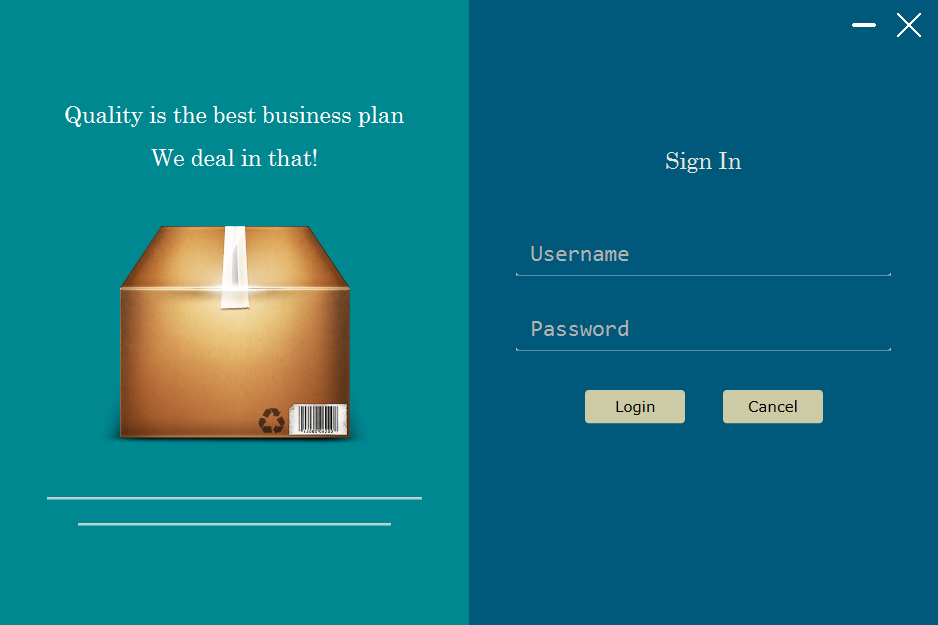
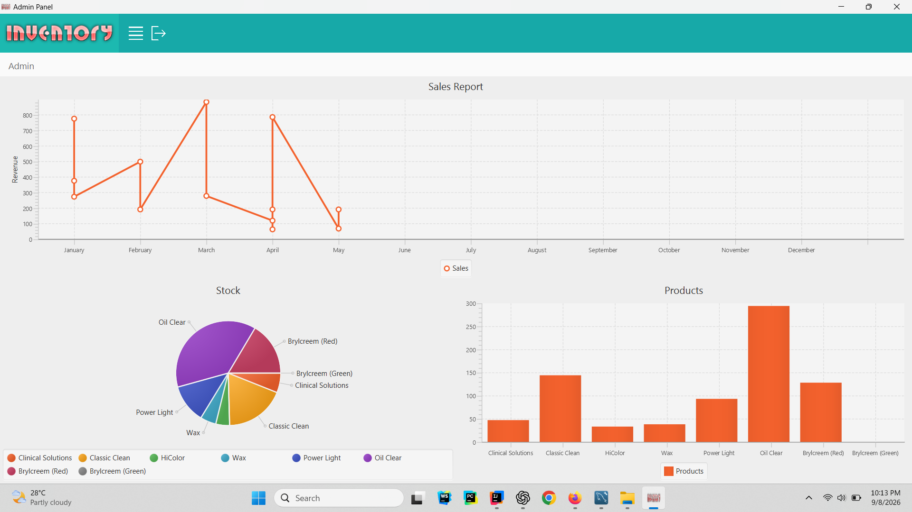

# Inventory Management System

A desktop-based **Inventory Management System and Point of Sale (POS)** application built with JavaFX, Hibernate, and MySQL.

## Screenshots

### Login



### Dashboard



## Features

- Product management
- Category management
- Supplier management
- Employee/user management
- Sales management
- Purchase management
- Invoice management
- Inventory tracking
- Point of Sale (POS)
- Dashboard with charts
- PDF invoice generation
- MySQL database integration

## Technologies

| Technology | Version |
|---|---|
| Java | 21 |
| JavaFX | 21.0.8 |
| Hibernate ORM | 6.6.56.Final |
| Jakarta Persistence | 3.1.0 |
| MySQL Connector/J | 9.4.0 |
| Apache Commons Codec | 1.19.0 |
| iText | 5.5.13.4 |
| Maven | 3.x |

## Requirements

- JDK 21
- Maven 3.x
- MySQL Server

JavaFX is managed through Maven, so a separate JavaFX SDK installation is not required.

## Database Configuration

Database credentials are loaded from:

```text
src/main/resources/application.properties
```

Example:

```properties
db.url=jdbc:mysql://localhost:3306/inventory
db.username=your_username
db.password=your_password
```

Make sure the `inventory` database exists in MySQL before starting the application.

> **Security:** Do not commit `application.properties` containing real database credentials to a public repository.

A template can be provided as:

```text
src/main/resources/application.properties.example
```

## Running the Application

### Using Maven

From the project root:

```bash
mvn clean javafx:run
```

### Using IntelliJ IDEA

Open the project as a Maven project and use **JDK 21** as the project SDK.

The application entry point is:

```text
com.rafsan.inventory.MainApp
```

## Building

To compile and package the application:

```bash
mvn clean package
```

The generated files are placed in:

```text
target/
```

Self-contained Windows deployment using `jlink` and `jpackage` is planned for a later stage.

## License

This project is licensed under the **MIT License**.

See the [LICENSE](LICENSE) file for details.

## Author

**Rafsan**

---

> This project is actively developed and may evolve over time.